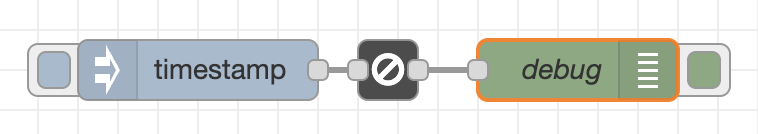

# node-red-mcu-gate

This package is a contribution to the [Node-RED MCU Edition](https://github.com/phoddie/node-red-mcu).


It provides a Node-RED node that implements a gate open only when the flow runs on an MCU.


## Rational
Flows designed to be run on an MCU tend to emit error messages during development - as the system they are developed on lacks dedicated features the flow expects to operate with. These error messages flood the Debug Panel and fog the view to relevant data.

This node may be placed into such flows, to pass messages only when the flow is running on an MCU.

There are two typical usage scenarios:

* Place the node shortly after the start of a flow - to suppress it's whole further execution.

* Place the node just before accessing e.g. a hardware asset like a GPIO pin - to block the execution & further processing from there on.

## Example

<details>
  <summary>flow.json</summary>

``` json
[
    {
        "id": "8e57486a6884e88d",
        "type": "tab",
        "label": "MCU Gate",
        "disabled": false,
        "info": "",
        "env": [],
        "_mcu": {
            "mcu": false
        }
    },
    {
        "id": "b047b7d4b7647eb6",
        "type": "inject",
        "z": "8e57486a6884e88d",
        "name": "",
        "props": [
            {
                "p": "payload"
            },
            {
                "p": "topic",
                "vt": "str"
            }
        ],
        "repeat": "",
        "crontab": "",
        "once": false,
        "onceDelay": 0.1,
        "topic": "",
        "payload": "",
        "payloadType": "date",
        "_mcu": {
            "mcu": false
        },
        "x": 180,
        "y": 160,
        "wires": [
            [
                "16586ed35da1e987"
            ]
        ]
    },
    {
        "id": "494754e7c9c51cfc",
        "type": "debug",
        "z": "8e57486a6884e88d",
        "name": "debug",
        "active": true,
        "tosidebar": true,
        "console": false,
        "tostatus": false,
        "complete": "payload",
        "targetType": "msg",
        "statusVal": "",
        "statusType": "auto",
        "_mcu": {
            "mcu": false
        },
        "x": 370,
        "y": 160,
        "wires": []
    },
    {
        "id": "16586ed35da1e987",
        "type": "mcu-gate",
        "z": "8e57486a6884e88d",
        "name": "",
        "l": false,
        "_mcu": {
            "mcu": false
        },
        "x": 275,
        "y": 160,
        "wires": [
            [
                "494754e7c9c51cfc"
            ]
        ]
    }
]
```
</details>



You may install this example directly from the Node-RED editor. Follow `Menu`-> `Import`-> `Examples`, then select `@ralphwetzel/node-red-mcu-gate`

## Installation
The best way to install this node is via the Node-RED Editors `Menu` -> `Manage palette` function.

Alternatively, you may install it directly utilizing `npm`:

``` bash
cd <userDir>
```
then
```bash
npm install @ralphwetzel/node-red-mcu-plugin
```

Please refer to the [Node-RED documentation](https://nodered.org/docs/user-guide/runtime/configuration) for details regarding `<userDir>`.
